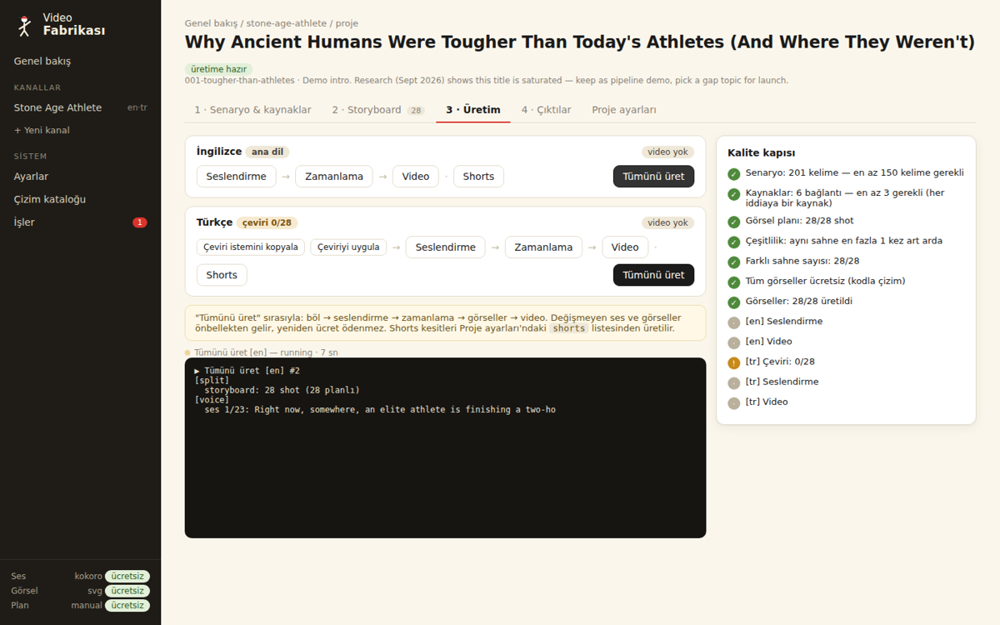
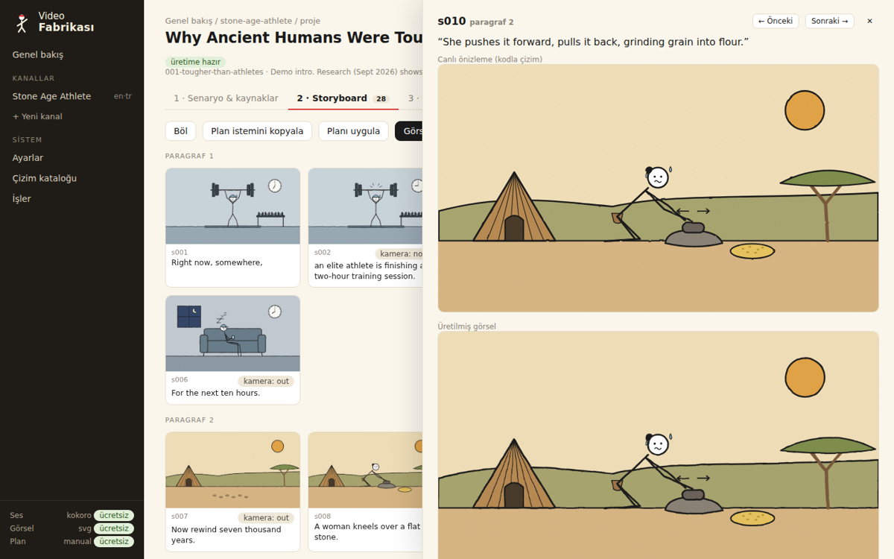

# Video Fabrikası

Birden çok YouTube kanalını tek bir üretim hattından çalıştıran, **senin bilgisayarında** çalışan bir video fabrikası.
Web panelinden yönetilir: fikir havuzu → senaryo → storyboard → seslendirme → görseller → video, Shorts ve derleme.
Başlangıçta her şey **ücretsiz** çalışır. İş büyüdüğünde her aşama tek ayarla ücretli servise geçer, kodda değişiklik gerekmez.



## Başlatma

1. Bir kez kur: **Python 3.10+** ve **FFmpeg**
   - Windows: `winget install Python.Python.3.12 Gyan.FFmpeg Git.Git`
   - Mac: `brew install python ffmpeg git`
2. Repoyu indir: `git clone https://github.com/tosunbeytullah9-ui/stone-age-athlete.git`
3. **Windows:** `start.bat` dosyasına çift tıkla. **Mac:** `./start.sh`
   - İlk açılışta kurulum birkaç dakika sürer.
   - Sonra panel tarayıcıda kendiliğinden açılır: http://127.0.0.1:8765

Panel sadece senin bilgisayarında çalışır, internete açılmaz.

## Bir video nasıl üretilir (panelden)

| Adım | Nerede | Ne olur |
| --- | --- | --- |
| 1. Fikri seç | Kanal → **Fikir havuzu** | 152 araştırılmış fikir, öncelik ve sütuna göre filtrelenir. "Projeye dönüştür" |
| 2. Senaryo ve kaynaklar | Proje → **1 · Senaryo** | Anlatım metni + kaynak listesi. Kalite kapısı eksikleri gösterir |
| 3. Böl | "Kaydet & böl" | Metin ~2,5 sn'lik shot'lara bölünür |
| 4. Planla | **2 · Storyboard** → "Plan istemini kopyala" | claude.ai'ye yapıştır, gelen cevabı "Planı uygula"ya yapıştır (ücretsiz). Her shot'a tıklayıp canlı önizlemeyle düzenlenebilir |
| 5. Üret | **3 · Üretim** → "Tümünü üret" | Ses, zamanlama, görseller, video. İlerleme canlı izlenir |
| 6. Diğer diller | 3 · Üretim → Türkçe satırı | "Çeviri istemini kopyala" → Claude → "Çeviriyi uygula" → "Tümünü üret". **Aynı görseller** kullanılır |
| 7. Çıktılar | **4 · Çıktılar** | Video, Shorts, bölüm zaman damgaları ve kaynaklarla hazır YouTube açıklaması |

Uzun "uyku için" derlemeler: Kanal → **Derleme**. Bitmiş videoları seç, tek tuşla birleştir.



## Ücretsizden ücretliye

Panel → **Ayarlar**: anahtarı yapıştır, ilgili satırı değiştir. Anahtarlar sadece bilgisayarındaki `.env` dosyasında durur.

| Aşama | Ücretsiz (varsayılan) | Ücretli |
| --- | --- | --- |
| Görsel planı ve çeviri | `planner.provider: manual` (Claude sohbeti) | `anthropic` (otomatik) |
| Ses (İngilizce) | `kokoro` (yerel) | `elevenlabs` |
| Ses (Türkçe) | `edge` (çevrimiçi) | `elevenlabs` |
| Görseller | `svg` (kodla çizim) | `gemini` (Nano Banana). Tek shot için de seçilebilir |

Her kanal bu ayarları kendi `channel.yaml → overrides` bölümünde ezebilir. Örneğin bir kanal ücretli ses kullanırken diğeri ücretsiz kalır.

## Yeni kanal

Panel → **+ Yeni kanal**. Her kanalın kendi adı, dilleri, maskotu, renk paleti, sesi ve fikir havuzu olur.
Üretim hattı ve çizim kütüphanesi ortaktır. Genişleme önerileri (Tıp Tarihi, Paranın Tarihi …) ve gerekçeleri
[docs/FACTORY.md](docs/FACTORY.md) içinde.

## YouTube politikasına karşı koruma

YouTube Temmuz 2026'dan beri şablonla seri üretilen içeriği para kazanmadan çıkarıyor. Fabrikadaki **kalite kapısı**
bir projeyi şu durumlarda "hazır" saymaz:

- senaryo 150 kelimenin altındaysa,
- 3'ten az kaynak varsa,
- planlanmamış shot varsa.

Aynı sahnenin art arda tekrarlanmasına ve düşük sahne çeşitliliğine de uyarı verir.

## Klasörler

```
config.yaml                     genel ayarlar (panel → Ayarlar)
channels/<kanal>/channel.yaml   kanal kimliği + kanala özel ayarlar
channels/<kanal>/ideas.yaml     fikir havuzu
channels/<kanal>/projects/<video>/   script.md, sources.md, storyboard.yaml, project.yaml, build/ (üretilenler)
studio/                         üretim hattı (tts, align, images, svgkit, planner, render, web)
docs/STORYBOARD.md              sahne tarifi biçimi · docs/catalog/ çizim kataloğu · docs/FACTORY.md mimari ve yol haritası
```

Komut satırı da var (panel aynı komutları kullanıyor): `python -m studio --help`. Testler: `python -m pytest -q`
